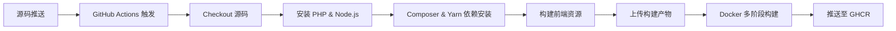

# Blessing Skin Build

> 企业级 Blessing Skin Server 构建系统 - 从源码到容器化部署的终极解决方案


## 项目概述

这是一个**工业级**的 Blessing Skin Server 构建与容器化部署系统。采用多阶段构建、智能缓存、自动化 CI/CD 流水线，实现从源码编译到生产环境部署的全链路自动化。

## 核心特性

- **多阶段 Docker 构建** - Alpine 构建阶段 + 生产运行阶段，镜像体积最小化
- **双环境架构** - 开发环境 (PHP 8.2) 与生产环境 (PHP 8.1) 隔离
- **自动化 CI/CD** - GitHub Actions 驱动的零人工干预构建流水线
- **智能缓存策略** - Composer、Yarn、Docker Buildx 多层缓存加速
- **全栈服务编排** - Nginx + PHP-FPM + Supervisor + MariaDB 一体化容器
- **GitHub Container Registry** - 自动推送至 ghcr.io，版本标签自动化

## 项目结构

```
blessing-skin-build/
├── .github/workflows/          # GitHub Actions CI/CD 流水线
│   └── build.yml               # 多分支并行构建配置
├── dev/                        # 开发环境 (PHP 8.2 + Imagick)
│   ├── Dockerfile              # 多阶段构建定义
│   ├── entrypoint.sh           # 容器启动入口脚本
│   ├── nginx.conf              # Nginx 高性能配置
│   ├── php.ini                 # PHP 运行时调优
│   ├── supervisord.conf        # 进程管理器配置
│   └── www.conf                # PHP-FPM 池配置
├── master/                     # 生产环境 (PHP 8.1 稳定版)
│   ├── Dockerfile              # 生产级多阶段构建
│   ├── entrypoint.sh           # 生产环境启动脚本
│   ├── nginx.conf              # 生产级 Nginx 配置
│   ├── php.ini                 # 生产 PHP 配置
│   ├── supervisord.conf        # 生产进程管理
│   └── www.conf                # 生产 PHP-FPM 配置
├── compose.yaml                # Docker Compose 服务编排
├── LICENSE                     # Apache 2.0 许可证
└── README.md                   # 项目文档
```

## 技术栈

| 组件 | 版本/说明 |
|------|----------|
| **PHP** | 8.1 (生产) / 8.2 (开发) |
| **Web 服务器** | Nginx |
| **进程管理** | Supervisor |
| **数据库** | MariaDB (最新版) |
| **PHP 扩展** | pdo_mysql, gd, zip, imagick (dev) |
| **构建工具** | Composer, Yarn, Node.js 24 |
| **CI/CD** | GitHub Actions |
| **容器仓库** | ghcr.io (GitHub Container Registry) |

## 构建流水线

### CI/CD 架构



### 构建流程详解

1. **源码获取** - 自动拉取 `our-mc/blessing-skin-server` 指定分支
2. **环境初始化** - 配置 PHP、Node.js 24、Composer、Yarn
3. **依赖安装** - 智能缓存加速的 Composer & Yarn 依赖安装
4. **资源构建** - PowerShell 脚本驱动的前端资源编译
5. **制品上传** - 构建产物打包为 GitHub Actions Artifacts
6. **Docker 构建** - 多阶段构建 + Buildx 缓存优化
7. **镜像推送** - 自动推送至 GitHub Container Registry

### 触发机制

- **Push 到 master 分支** - 触发生产环境构建
- **Push 到 dev 分支** - 触发开发环境构建
- **手动触发** - 支持 workflow_dispatch 手动执行

## 快速开始

### 前置要求

- Docker & Docker Compose
- 至少 2GB 可用内存
- 端口 8079 未被占用

### 开发环境

开发环境包含完整的调试工具和 Imagick 扩展，适合本地开发与测试。

```bash
# 启动开发环境
docker-compose up -d

# 查看容器状态
docker-compose ps

# 查看实时日志
docker-compose logs -f
```

### 生产环境

生产环境经过优化，使用稳定的 PHP 8.1 和精简的扩展集。

```bash
# 启动生产环境
docker-compose -f compose.yaml up -d

# 验证服务状态
curl http://localhost:8079
```

### 服务访问

| 服务 | 地址 | 说明 |
|------|------|------|
| **Web 应用** | http://localhost:8079 | Blessing Skin Server |
| **数据库** | localhost:3306 | MariaDB (内部网络) |

### 数据持久化

```yaml
volumes:
  - ./data/skin/plugins:/var/www/html/plugins      # 插件数据
  - ./data/skin/env:/var/www/html/env              # 环境配置
  - ./data/skin/storage:/var/www/html/storage      # 存储文件
  - ./data/skin/public/storage:/var/www/html/public/storage  # 公共资源
  - ./data/db:/var/lib/mysql:Z                     # 数据库文件
```

## Docker 镜像

### 镜像标签

| 标签 | 说明 | PHP 版本 |
|------|------|----------|
| `master` | 生产环境稳定版 | 8.1 |
| `dev` | 开发环境最新版 | 8.2 |
| `<sha>` | Git Commit SHA | 对应分支 |

### 拉取镜像

```bash
# 生产环境
docker pull ghcr.io/our-mc/blessing-skin-build:master

# 开发环境
docker pull ghcr.io/our-mc/blessing-skin-build:dev
```

## 架构设计

### 多阶段构建

```dockerfile
# 阶段 1: Alpine 构建器 - 源码整理与优化
FROM alpine AS builder
# 清理、重组、符号链接...

# 阶段 2: PHP 运行环境 - 生产级容器
FROM php:8.x-fpm
# Nginx + PHP-FPM + Supervisor 全栈集成
```

### 容器内部架构

```
┌─────────────────────────────────────┐
│           Supervisor                │
│  ┌──────────────┬───────────────┐   │
│  │    Nginx     │   PHP-FPM     │   │
│  │  (Web Server)│  (App Server) │   │
│  └──────────────┴───────────────┘   │
│                                     │
│  /var/www/html/                     │
│  ├── plugins/  (插件数据)           │
│  ├── storage/  (存储文件)           │
│  └── env/      (环境配置)           │
└─────────────────────────────────────┘
```

## 环境变量配置

数据库连接配置示例：

```yaml
environment:
  - MARIADB_USER=blessingskin
  - MARIADB_PASSWORD=yourpassword
  - MARIADB_DATABASE=blessingskin
  - MARIADB_ROOT_PASSWORD=yourrootpassword
```

## 许可证

本项目采用 [Apache License 2.0](LICENSE) 许可证。

---

> **Built with Docker & GitHub Actions** - 从源码到生产环境的无缝部署体验
